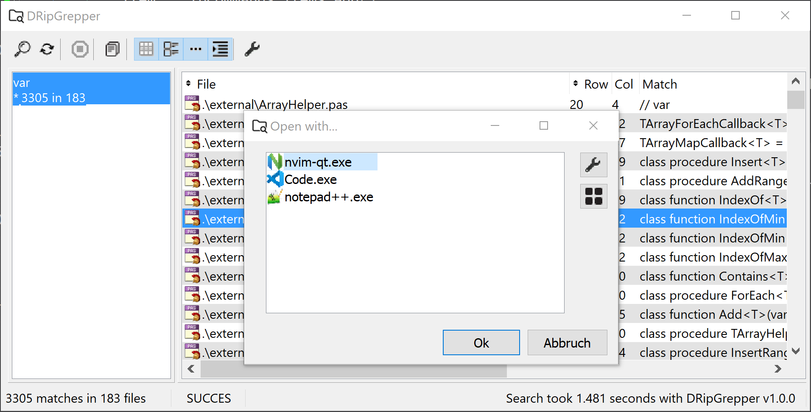
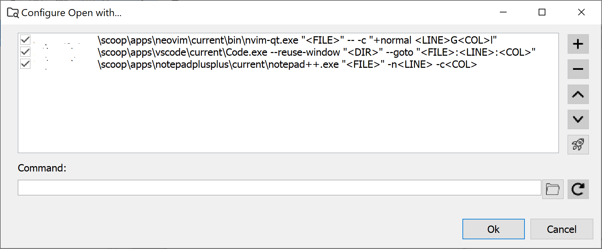

## DRipGrepper
Yet another [ripgrep](https://github.com/BurntSushi/ripgrep) GUI, written in Delphi Pascal with the goal to integrate it as an extension into the Delphi IDE.

## Features and todos

### Main Window
- [x] search text, parse `rg` output
  - [x] --vimgrep parser
  - [x] error parser: if a line couldn't be parsed, then it is put the first column
  - [ ] --pretty parser
  - [ ] --stats parser eg. msgbox on end with search statistics
  - [ ] no match parser
- [x] toolbar buttons to show/hide
  - [x] icons
  - [x] full/relative path
  - [x] alternate row colors
- [x] copy `rg` command line into clipboard
- [x] sorting by path and row
- [ ] grouping by path

### Search Dialog
- [x] help parametrizing `rg` in search dialog
  - [x] filter help texts: can't be selected 
  - [ ] filter not appropriate parameters
  - [ ] quick buttons for
    - [ ] --ignore-case
    - [ ] --case-sensitive
    - [ ] --word-regexp
    - [ ] --fixed-strings
  - [ ] --glob settings as separate editbox

### Open with...
- [x] show configured editors to open matching file on matching position
   - [x] on double click
   - [x] with menu / toolbar
- [ ] separate editor for distinct extensions

### Configure Open with...

### Configuration
- [x] configuration is stored in ini file
  - [x] search text history saved
  - [x] search paths history saved
  - [x] `rg` parameter history saved
  - [x] view settings saved
    - [x] ShowFileIcon
    - [x] ShowRelativePath
    - [x] AlternateRowColors
    - [x] IndentLines
  - [ ] configurable length of history 
  - [x] *Open with...* settings saved
- [ ] configuration dialog

### Misc
- [ ] delphi IDE extension https://github.com/mattia72/DRipGrepper/issues/1
- [x] standalone release
- [ ] delphi extension release
- [x] screenshots in Readme.md
- [ ] scoop install
- [ ] chocolatey install

## Thanks
-  [ripgrep](https://github.com/BurntSushi/ripgrep)
-  [dprocess](https://stackoverflow.com/a/45029879/2923283): port from freepascal
-  [GExpert](https://www.gexperts.org/download): idea, code and IDE integration framework
-  [dzlib](https://sourceforge.net/p/dzlib/code/HEAD/tree)
-  [UniSynEdit](https://sourceforge.net/projects/synedit)
