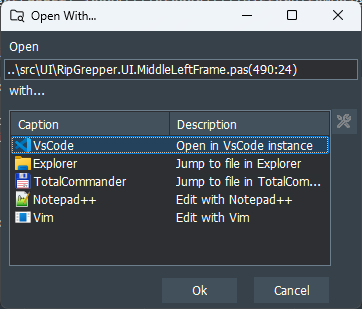

## :droplet: DRipGrepper
Yet another [ripgrep](https://github.com/BurntSushi/ripgrep) GUI, written in Delphi Pascal.
The goal is to create a useful standalone helper tool for searching and parametrizing [ripgrep](https://github.com/BurntSushi/ripgrep), then integrating as Delphi IDE extension.
The [release](https://github.com/mattia72/DRipGrepper/releases) includes the standalone exe and a bpl file, which can be used as Delphi extension.


## Features and Todos
Marked with checkmark if ready, else planned.

- [x] searches text, parses `rg` output
  - [x] --vimgrep parser
  - [x] error parser: if a line couldn't be parsed, then it is put in the first column (it maybe encoding problem)
 - [x] toolbar buttons to 
  - [x] expand/collapse tree
  - [x] show/hide icons
  - [x] full/relative path
  - [x] alternate row colors
- [x] copy `rg` command line into clipboard
- [ ] sorting result groups by row / col / text
- [ ] filtering results
- [ ] file handling (eg. open in explorer, copy, rename, delete)
- [x] replace text in files --replace=TEXT
- [x] unicode support

### :mag: Search Dialog


- [x] helps parametrizing `rg.exe` in search dialog
  - [x] expert mode set in `DripGrepper.ini` makes rg options visible
    - [x] option helper form 
  - [x] quick buttons for
    - [x] --ignore-case
    - [x] --case-sensitive
    - [x] --word-regexp
    - [x] --fixed-strings
  - [x] --glob filter settings can be set in separate editbox
  - [x] --hidden, --no-ignore can be set
  - [x] --pretty can be set (not supported by rg.exe in vscode)
  - [x] --context NUM (or -A=NUM -B=NUM) parser
  - [ ] --invert-match parser
  - [ ] --stats parser eg. msgbox on end with search statistics


### :rocket: Open with...


- [x] show configured editors to open matching file on matching position
   - [x] on double click
   - [x] with menu / toolbar
- [ ] separate editors for distinct extensions

### Configure Open with...


### Examples:
* `C:\Program Files\Notepad++\notepad++.exe "<FILE>" -n<LINE> -c<COL>`
* `C:\Program Files\Microsoft VS Code\Code.exe --reuse-window "<DIR>" --goto "<FILE>:<LINE>:<COL>"`
* `C:\Program Files\Git\usr\bin\vim.exe -u "C:\Program Files\Git\etc\vimrc"  -c "+normal <LINE>G<COL>l" "<FILE>" `
* `nvim-qt.exe "<FILE>" -- -c "+normal <LINE>G<COL>l"`

### Configuration
Configuration is stored in ini file (`DripGrepper.ini` for standalone and `DripExtension*.ini` for the extension)
  - [x] search text history saved
  - [x] search paths history saved
  - [x] `rg` parameter history saved
  - [x] view settings saved
    - [x] ShowFileIcon
    - [x] ShowRelativePath
    - [x] AlternateRowColors
    - [x] IndentLines
    - [x] ExpandNodes
  - [ ] configurable length of history 
  - [x] *Open with...* settings saved
  - [ ] DebugTrace switch
  - [x] config form 
    - [x] Open with...
    - [ ] App settings: rg path, debug trace, expert mode
    - [ ] Extension
    - [ ] View : colors

### Delphi Extension 


  - [x] dockable window
  - [x] high DPI Scaling 
  - [x] menu item in Tools (shortcut configurable in `DripExtension*.ini`)
  - [x] Default shortcut Shift+Alt+R ( :warning: conflict with GExpert/MMX Reverse Statement)
  - [x] click on matching file, opens file in the editor on position 
     - [ ] expand collapsed code in {$REGION}-s
  - [x] popup menu
    - [x] delete history entries
    - [x] copy path etc.
    - [x] insert file as `uses` to interface/implementation section
  - [x] save window position
     - [x] save in layout
     - [x] load saved layout
  - [x] search selected text
     - [ ] multi line selection handling (in ini?)
  - [ ] search only in opened files/project files/project group
  - [x] delphi extension release

 
### Misc
- [x] screenshots in Readme.md
- [x] [scoop](https://scoop.sh) install
  - [x] standalone
  - [x] delphi ide extension
- [ ] [chocolatey](https://chocolatey.org) install

## Installation

If you want to be up to date with the latest versions.
Install [Scoop](https://scoop.sh), and then you can install and update dripgrepper from the
[official bucket](https://github.com/mattia72/scoop) :cool:

```
scoop bucket add dripgrepper-bucket https://github.com/mattia72/scoop
scoop install dripgrepper
```

## Thanks
-  [ripgrep](https://github.com/BurntSushi/ripgrep)
-  [CnPack](https://www.cnpack.org)
-  [DDevExtensions](https://github.com/ahausladen/DDevExtensions)
-  [dprocess](https://stackoverflow.com/a/45029879/2923283): port from freepascal
-  [dzlib](https://sourceforge.net/p/dzlib/code/HEAD/tree)
-  [GExpert](https://www.gexperts.org/download)
-  [regexpr](https://regex.sorokin.engineer/en/latest/)
-  [UniSynEdit](https://sourceforge.net/projects/synedit)
-  [VirtualTreeView](https://github.com/TurboPack/VirtualTreeView)
