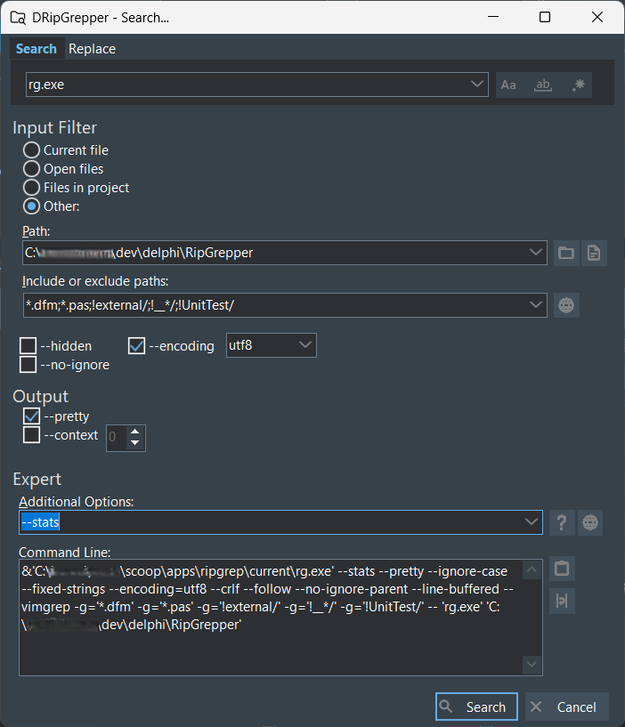
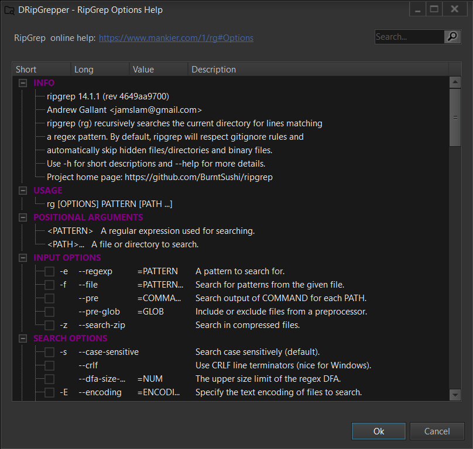

## Table of Contents
- [DRipGrepper](#droplet-dripgrepper)
- [Features and Todos](#features-and-todos)
- [Search Dialog](#mag-search-dialog)
- [Open with...](#rocket-open-with)
- [Configuration](#configuration)
- [Delphi Extension](#delphi-extension)
- [Installation](#installation)
  - [Scoop](#scoop)
  - [Manual](#manual)
  - [Delphi Integration](#delphi-integration)
- [Thanks](#thanks)

## :droplet: DRipGrepper
Yet another [ripgrep](https://github.com/BurntSushi/ripgrep) GUI, written in Delphi Pascal.
The goal is to create a useful Delphi IDE extension for fast searching and a standalone tool for parametrizing [ripgrep](https://github.com/BurntSushi/ripgrep).
The [release](https://github.com/mattia72/DRipGrepper/releases) includes the standalone exe and the extension dll.


## Features and Todos
Marked with checkmark if ready, else planned.
Most actual working items, you will find in the last [release notes](https://github.com/mattia72/DRipGrepper/releases) 

- [x] Searches text, parses output of `rg --vimgrep` 
  - [x] Error parser: if a line couldn't be parsed, it is placed in the first column (it may be an encoding problem)
- [x] Toolbar buttons to:
  - [x] Expand/collapse tree
  - [x] Show/hide icons
  - [x] Full/relative path
  - [x] Alternate row colors
- [x] Copy `rg` command line into clipboard
- [ ] Sorting result groups by row/col/text
- [x] Filtering results
  - [x] Filter by file path/matching lines
- [x] File handling (e.g., open in explorer or in another tool)
- [x] Replace text in files with `--replace=TEXT`
- [x] Unicode support

### :mag: Search Dialog


- [x] Helps parametrizing `rg.exe` 
  - [x] Expert mode set in `DripGrepper.ini` makes `rg` options visible
    - [x] Option helper form generated from `rg` help 
  - [x] Quick buttons for:
    - [x] `--ignore-case`
    - [x] `--case-sensitive`
    - [x] `--word-regexp`
    - [x] `--fixed-strings`
  - [x] `--glob` filter settings can be set in a separate edit box
  - [x] `--hidden`, `--no-ignore` can be set
  - [x] `--pretty` can be set (not supported by `rg.exe` in VSCode)
  - [x] `--context NUM` (or `-A=NUM -B=NUM`) parser
  - [ ] `--invert-match` parser
  - [x] `--stats` parser, e.g., message box on end with search statistics

### :rocket: Open with...


- [x] Show configured editors to open matching files at the matching position
  - [x] On double-click
  - [x] Via menu/toolbar
- [ ] Separate editors for distinct file extensions

### Configure Open with...


### Examples:
* `C:\Program Files\Notepad++\notepad++.exe "<FILE>" -n<LINE> -c<COL>`
* `C:\Program Files\Microsoft VS Code\Code.exe --reuse-window "<DIR>" --goto "<FILE>:<LINE>:<COL>"`
* `C:\Program Files\Git\usr\bin\vim.exe -u "C:\Program Files\Git\etc\vimrc"  -c "+normal <LINE>G<COL>l" "<FILE>" `
* `nvim-qt.exe "<FILE>" -- -c "+normal <LINE>G<COL>l"`

### Configuration
Configuration is stored in ini file (`DripGrepper.ini` for standalone and `DripExtension.ini` for the extension)
  - [x] *Open with...* settings saved
  - [x] DebugTrace switch
  - [x] config form
    - [x] Open with...
    - [x] View settings: colors
    - [x] App settings: rg path, debug trace, expert mode
      - [ ] configurable length of history
    - [x] Extension settings

### Delphi Extension 


- [x] Dockable window
- [x] High DPI scaling
- [x] Menu item in Tools (shortcut configurable in `DripExtension*.ini`)
- [x] Default shortcut Shift+Alt+R (:warning: conflict with GExpert/MMX Reverse Statement)
- [x] Click on matching file opens file in the editor at the position
  - [ ] Expand collapsed code in {$REGION}-s
- [x] Popup menu
  - [x] Delete history entries
  - [x] Copy path, etc.
  - [x] Insert file as `uses` to interface/implementation section
- [x] Save window position
  - [x] Save in layout
  - [x] Load saved layout
- [x] Search selected text
  - [ ] Multi-line selection handling (in ini?)
- [ ] Search only in opened files/project files/project group
  - [ ] Search type, variable declaration, function definition

## Installation

### Scoop
If you want to be up to date with the latest versions.
Install [Scoop](https://scoop.sh), and then you can install and update dripgrepper from the
[official bucket](https://github.com/mattia72/scoop) :cool:

```
scoop bucket add dripgrepper-bucket https://github.com/mattia72/scoop
scoop install dripgrepper
```

### Manual
* Download latest [release](https://github.com/mattia72/DRipGrepper/releases)
* Unzip

#### Delphi Integration
##### As BPL package
* Open Delphi
* Open `Tools | GetIt-Package-Manager` 
* Install `VirtualTree for VCL`
* Open `Component | Install Packages...`
* Add `DripExtension.bpl` to Design packages list
* Ready
##### As Expert DLL  
* Run `DripGrepper.exe`
* Open Config...
* Select Extension tab
* Push Install... 
  * (If not found in current folder, select `DripExtensions.dll`)
* Restart Delphi

## Thanks
-  [ripgrep](https://github.com/BurntSushi/ripgrep)
-  [CnPack](https://www.cnpack.org)
-  [DDevExtensions](https://github.com/ahausladen/DDevExtensions)
-  [dprocess](https://stackoverflow.com/a/45029879/2923283): port from freepascal
-  [dzlib](https://sourceforge.net/p/dzlib/code/HEAD/tree)
-  [GExpert](https://www.gexperts.org/download)
-  [regexpr](https://regex.sorokin.engineer/en/latest/)
-  [UniSynEdit](https://sourceforge.net/projects/synedit)
-  [VirtualTreeView](https://github.com/TurboPack/VirtualTreeView)
-  [SVGIconImageList](https://github.com/EtheaDev/SVGIconImageList)
