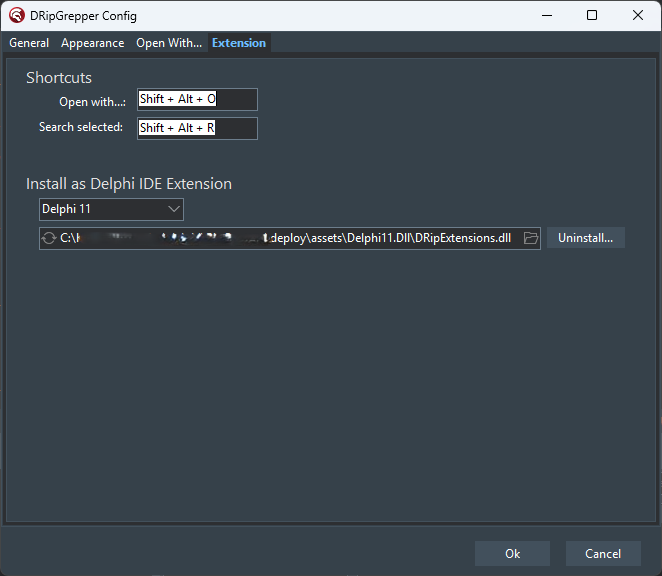

## Table of Contents
- [DRipGrepper](#droplet-dripgrepper)
- [Features and Todos](#features-and-todos)
- [Search Dialog](#mag-search-dialog)
- [Open with...](#rocket-open-with)
- [Configuration](#configuration)
- [Delphi Extension](#delphi-extension)
- [Installation](#installation)
  - [Scoop](#scoop)
  - [Manual](#manual)
  - [Delphi Integration](#delphi-integration)
- [Contribution](#contribution)
- [Thanks](#thanks)

## :droplet: DRipGrepper
Yet another [ripgrep](https://github.com/BurntSushi/ripgrep) GUI, written in Delphi Pascal.
The goal is to create a useful Delphi IDE extension for fast searching and a standalone tool for parametrizing [ripgrep](https://github.com/BurntSushi/ripgrep).
The [release](https://github.com/mattia72/DRipGrepper/releases) includes the standalone exe and the extension dll.


## Features and Todos
Marked with checkmark if ready, else planned.
Most actual working items, you will find in the last [release notes](https://github.com/mattia72/DRipGrepper/releases) 

- [x] Searches text, parses output of `rg --vimgrep` 
- [x] Sorting result groups by row/col/text
- [x] Filtering results by file path/matching lines
- [x] Copy `rg` command line into clipboard
- [x] File handling (e.g., open in explorer or in another tool)
- [x] Replace text in files with `--replace=TEXT`
- [x] Storing search history between sessions (experimental)

### :mag: Search Dialog


- [x] Helps parametrizing [ripgrep](https://github.com/BurntSushi/ripgrep) (`rg.exe`)
  - [x] Quick buttons for: `--ignore-case`, `--case-sensitive`, `--word-regexp`, `--fixed-strings`
  - [x] `--glob` filter settings can be set in a separate edit box
  - [x] `--hidden`, `--no-ignore` can be set
  - [x] `--pretty` can be set (not supported by `rg.exe` in VSCode)
  - [x] `--context NUM` (or `-A=NUM -B=NUM`) parser
  - [ ] `--invert-match` parser
  - [x] `--stats` parser (can be set in *Additional Options*)
  - [x] Setting Expert mode in config form or in `DripGrepper.ini` makes `rg` options visible
    - [x] Option helper form generated from `rg` help: [Screenshot](./screenshots/OptionsHelpForm.png)
  - [x] Generated command line can be examined in edit box

### :rocket: Open with...

- [x] Shortcut Shift+Alt+O 

#### Configure


Examples can be found in the [wiki](https://github.com/mattia72/DRipGrepper/wiki/Open-With...-help-and-samples)

### Configuration
Configuration is stored in ini file (`DripGrepper.ini` for standalone and `DripExtension.ini` for the extension)
Many settings can be set in the config form, but some are only available in the ini file.




### Delphi Extension 


- [x] Menu item in Tools 
- [x] Shortcut Shift+Alt+R (:warning: conflict with GExpert/MMX Reverse Statement)
- [x] Click on matching file opens file in the editor at the position
- [x] Popup menu for
  - [x] Delete history entries
  - [x] Copy path, etc.
  - [x] Add file to `uses` list in interface/implementation section

## Installation

### Scoop
If you want to be up to date with the latest versions.
Install [Scoop](https://scoop.sh), and then you can install and update dripgrepper from the
[official bucket](https://github.com/mattia72/scoop) :cool:

```
scoop bucket add dripgrepper-bucket https://github.com/mattia72/scoop
scoop install dripgrepper
```

### Manual
* Download latest [release](https://github.com/mattia72/DRipGrepper/releases)
* Unzip

#### Delphi Integration
##### As Expert DLL  
* Run `DripGrepper.exe`
* Open Config...
* Select Extension tab
* Push Install... 
  * (If not found in current folder, select `DripExtensions.dll`)
* Restart Delphi
##### As BPL package (deprecated)
* Open Delphi
* Open `Tools | GetIt-Package-Manager` 
* Install `VirtualTree for VCL`
* Open `Component | Install Packages...`
* Add `DripExtension.bpl` to Design packages list
* Ready

## Contribution
To submit a pull request, follow these steps:

* Fork the project
* Create a new branch (`git checkout -b 'my-new-feature'`)
* Make your changes
* Make the commit (`git commit -am 'Functionality or adjustment message'`)
* Push the branch (`git push origin Message about functionality or adjustment`)
* Open a pull request

## Thanks
-  [ripgrep](https://github.com/BurntSushi/ripgrep)
-  [CnPack](https://www.cnpack.org)
-  [DDevExtensions](https://github.com/ahausladen/DDevExtensions)
-  [dprocess](https://stackoverflow.com/a/45029879/2923283): port from freepascal
-  [dzlib](https://sourceforge.net/p/dzlib/code/HEAD/tree)
-  [GExpert](https://www.gexperts.org/download)
-  [regexpr](https://regex.sorokin.engineer/en/latest/)
-  [UniSynEdit](https://sourceforge.net/projects/synedit)
-  [VirtualTreeView](https://github.com/TurboPack/VirtualTreeView)
-  [SVGIconImageList](https://github.com/EtheaDev/SVGIconImageList)
-  [spring4d](https://bitbucket.org/sglienke/spring4d)
