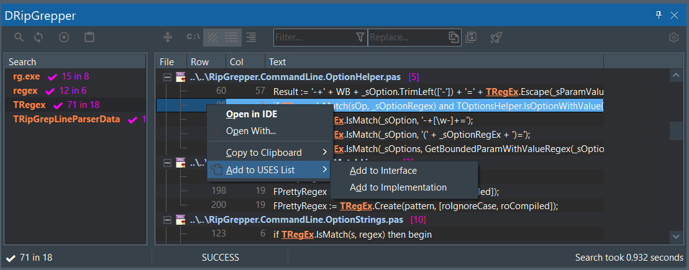

# :droplet: DRipGrepper

A powerful [ripgrep](https://github.com/BurntSushi/ripgrep) GUI written in Delphi Pascal, featuring both a standalone application and Delphi IDE extension for fast text searching across files.


## Features

**Core Functionality**
- Advanced `ripgrep` parameter configuration with expert mode
- Result filtering by file path and matching lines
- Text replacement with preview
- Search history with session persistence
- "Open with..." integration ([wiki examples](https://github.com/mattia72/DRipGrepper/wiki/Open-With...-help-and-samples))

**Delphi Extension**
- Delphi 11, 12 support
- Tools menu integration (Shift+Alt+R)
- Direct file opening at search position
- Add files to `uses` clauses
- [OpenInDelphi](https://marketplace.visualstudio.com/items?itemName=Mattia72-OpenInDelphi.openindelphi) VS Code integration



## Installation

### :package: Scoop (Recommended)
```powershell
scoop bucket add dripgrepper-bucket https://github.com/mattia72/scoop
scoop install dripgrepper
```

### :computer: Manual Installation
1. Download latest [release](https://github.com/mattia72/DRipGrepper/releases)
2. Extract files to desired location

#### Delphi IDE Integration
1. Run `DripGrepper.exe` → Config → Extension tab → Install...
2. Select `DripExtensions.dll` (if not auto-detected)
3. Restart Delphi

## Update

**Scoop**: `scoop update dripgrepper`

**Manual**: Close DripGrepper and Delphi, delete all files except `.ini` settings, then extract new release.

## Contributing
[Contribution guidelines for this project](CONTRIBUTING.md)

## Acknowledgments
-  [ripgrep](https://github.com/BurntSushi/ripgrep)
-  [CnPack](https://www.cnpack.org)
-  [DDevExtensions](https://github.com/ahausladen/DDevExtensions)
-  [dprocess](https://stackoverflow.com/a/45029879/2923283): port from freepascal
-  [dzlib](https://sourceforge.net/p/dzlib/code/HEAD/tree)
-  [GExpert](https://www.gexperts.org/download)
-  [regexpr](https://regex.sorokin.engineer/en/latest/)
-  [UniSynEdit](https://sourceforge.net/projects/synedit)
-  [VirtualTreeView](https://github.com/TurboPack/VirtualTreeView)
-  [SVGIconImageList](https://github.com/EtheaDev/SVGIconImageList)
-  [spring4d](https://bitbucket.org/sglienke/spring4d)
-  [FastMM4](https://github.com/pleriche/FastMM4) 
